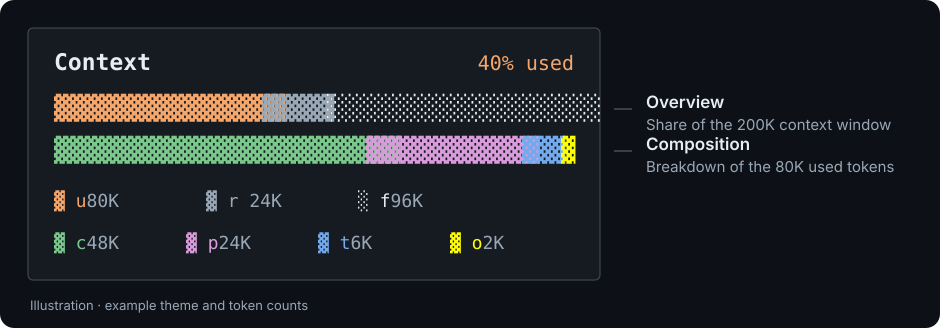

# opencode-tui-context

**在 OpenCode 侧边栏，一眼看清上下文占用与 token 构成。**

[](LICENSE)
[](#环境要求)

[English](README.md) · 简体中文 · [日本語](README.ja.md)

用两条紧凑的分段条，显示模型上下文窗口的已用空间、输出预留空间，以及缓存、提示、推理和输出各自占用的 token。



*图中为示例数据与配色；实际颜色随 OpenCode 主题变化，输出段固定为黄色。*

- **两个视角，一份快照**：上方看窗口容量，下方看已用 token 的构成。
- **适应侧边栏宽度**：进度条自动缩放，空间变窄时图例会堆叠或简化。
- **随会话更新**：通过事件刷新，无需轮询。
- **按需精简显示**：可隐藏指定分段或两组图例。
- **直接读取已有用量**：无需额外模型调用、tokenizer 或凭据。

面板反映的是**最近一条带有输出 token 的 assistant 消息**，不代表整个会话的累计账单，也不是对下一次提示词的精确计数。

[快速开始](#快速开始) · [读懂面板](#读懂面板) · [配置](#配置) · [常见问题](#常见问题) · [开发与贡献](#开发与贡献)

## 快速开始

### 环境要求

- **OpenCode `>=1.18.0`**，与 [package.json](package.json) 的声明一致。开发使用的 SDK 固定为 `1.18.31`；这不表示所有后续宿主版本都经过了实际验证。
- 以下原生安装命令已按 **OpenCode `1.18.31`** 核对。旧版本请先检查 `opencode plugin --help`，或升级 OpenCode。
- npm 和预构建 ZIP 安装无需在本地编译。只有源码安装需要 **Git、[Bun](https://bun.sh/) 和 [Node.js](https://nodejs.org/)**。

### npm 安装（发布后推荐）

> **首次 npm 发布准备中。** 当前请使用[源码安装](#从源码安装)；下方一行命令在 npm 包发布后可用。

```sh
opencode plugin -g opencode-tui-context
```

OpenCode 会下载预构建包并自动将插件写入全局 `tui.json`，重启后即可加载。只为当前项目安装时，省略 `-g`。也可以在命令面板选择 **Install plugin**，输入 `opencode-tui-context`，并切换到全局范围。详见宿主的[安装说明](https://github.com/anomalyco/opencode/blob/v1.18.31/packages/opencode/specs/tui-plugins.md#package-manifest-and-install)。

从本地安装迁移时，请移除 `tui.json` 中旧的路径条目，避免重复加载。

### 备用方式：预构建 ZIP

发布附件提供预构建包后，可在 npm 不可用时使用：

1. 打开 [Releases](https://github.com/SolitudeRA/opencode-tui-context/releases)，在 **Assets** 中下载 `opencode-tui-context-<version>.zip`。GitHub 自动生成的 **Source code** 压缩包仍需编译。
2. 将压缩包中的 `opencode-tui-context` 目录解压到 `tui.json` 同级的 `local-plugins/` 中。默认全局位置是 `~/.config/opencode/local-plugins/`（Windows 为 `$HOME\.config\opencode\local-plugins\`）。保留其中的 `package.json` 和 `dist/tui.js`。
3. 添加下方的[本地插件配置](#启用本地安装)，然后重启 OpenCode。

如果该版本尚未提供预构建 ZIP 附件，请使用下面的源码安装。

### 从源码安装

<details>
<summary>构建并复制插件（当前可用）</summary>

需要 Git、Bun 和 Node.js。克隆仓库并构建 `dist/tui.js`：

```sh
git clone https://github.com/SolitudeRA/opencode-tui-context.git
cd opencode-tui-context
bun install --frozen-lockfile
bun run build
```

构建产物为 `dist/tui.js`。

在仓库根目录，根据系统将构建产物与清单复制到全局插件目录。

**macOS / Linux**

```sh
mkdir -p "$HOME/.config/opencode/local-plugins/opencode-tui-context"
cp -R dist package.json "$HOME/.config/opencode/local-plugins/opencode-tui-context/"
```

**Windows PowerShell**

```powershell
$pluginDir = Join-Path $HOME ".config/opencode/local-plugins/opencode-tui-context"
New-Item -ItemType Directory -Force -Path $pluginDir | Out-Null
Copy-Item -Path dist, package.json -Destination $pluginDir -Recurse -Force
```

</details>

### 启用本地安装

ZIP 或源码安装完成后，将下面的条目合并到 `~/.config/opencode/tui.json`（Windows 为 `$HOME\.config\opencode\tui.json`），保留已有设置和其他插件：

```json
{
  "plugin": ["./local-plugins/opencode-tui-context"]
}
```

保留下面的目录结构：清单中的 `./tui` 导出指向 `dist/tui.js`。目标目录无需包含源码或 `node_modules`。

```text
local-plugins/opencode-tui-context/
├── package.json
└── dist/
    └── tui.js
```

路径相对于 `tui.json` 所在目录解析。如果使用自定义配置位置，请相应调整复制目录，或使用插件的绝对路径。Windows 的 JSON 路径可以用正斜杠，例如 `D:/Codeing/opencode-tui-context`。不要在 JSON 插件条目中使用 `~/...`，`1.18.31` 的加载器不会展开它。依据见宿主的[配置路径解析](https://github.com/anomalyco/opencode/blob/v1.18.31/packages/opencode/src/config/plugin.ts#L38-L54)和[插件路径识别](https://github.com/anomalyco/opencode/blob/v1.18.31/packages/opencode/src/plugin/shared.ts#L158-L176)。

### 显示面板

配置应写在 **`tui.json`** 中，而不是 `opencode.json` 的服务端插件列表。重启 OpenCode，打开会话并显示侧边栏。assistant 消息报告输出 token 后，**Context** 面板就会显示用量；此前显示 `no assistant turns yet`。

如果希望用本插件替换 OpenCode 内置的上下文面板，再合并以下设置：

```json
{
  "plugin_enabled": {
    "internal:sidebar-context": false
  }
}
```

若两个面板仍同时出现，请检查 OpenCode 插件管理器中保存的启停状态，它可能覆盖配置文件的设置。其他侧边栏插件可以继续启用。启停优先级见宿主的 [TUI 插件说明](https://github.com/anomalyco/opencode/blob/v1.18.31/packages/opencode/specs/tui-plugins.md)。

## 读懂面板

**上方总览条**把模型上下文窗口划分为已用、预留和剩余空间；**下方构成条**只拆分已用 token。两条的分母不同，因此上方仍有大量空闲时，下方也可能已经填满。

| 所属条 | 图例 | 分段 | 含义 |
| --- | --- | --- | --- |
| 总览 | `u` | `used` | 输入 + 缓存读取 + 缓存写入 + 推理 + 输出 |
| 总览 | `r` | `reserved` | 模型输出上限减去已报告的输出量，最低为零 |
| 总览 | `f` | `free` | 上下文窗口减去已用量和预留量，最低为零 |
| 构成 | `c` | `cached` | 缓存读取 token |
| 构成 | `p` | `prompt` | 输入 + 缓存写入 token |
| 构成 | `t` | `think` | 推理 token |
| 构成 | `o` | `out` | 输出 token |

标题中的百分比由 `used / window` 四舍五入得到。图例使用 `17.5K` 这样的紧凑计数。实心 `▓` 表示用量或预留量，`░` 表示总览条的剩余空间。

侧边栏变窄时，每组图例会依次将计数移到标记下方、隐藏计数、隐藏整组图例。标题会先隐藏百分比，再隐藏 `Context`。增大侧边栏宽度后，细节会重新显示。

大多数颜色取自宿主主题：`used` → `primary`、`cached` → `success`、`prompt` → `accent`、`think` → `secondary`、`reserved` → `textMuted`、`free` → `text`。输出段固定使用黄色（`#ffff00`），在浅色主题下可能对比度不足。

## 配置

npm 安装后，在 `tui.json` 中将包名条目改成 `[包名, 选项]` 元组。如果原条目带有 `@版本号` 且希望继续固定该版本，请保留版本后缀：

```json
{
  "plugin": [
    [
      "opencode-tui-context",
      {
        "barWidth": 24,
        "exclude": [],
        "showLegend": true
      }
    ]
  ]
}
```

ZIP 或源码安装请将示例中的包名替换为 `"./local-plugins/opencode-tui-context"`。修改已有条目即可，不要重复添加。

| 选项 | 类型 | 默认值 | 行为 |
| --- | --- | --- | --- |
| `barWidth` | `number` | `24` | 实测前的初始**面板外宽**，四舍五入后限制在 `8–120`。进度条会扣除边框和内边距占用的四列。取得测量值后，跟随侧边栏的实际宽度；此选项不能固定进度条宽度。 |
| `exclude` | `string[]` | `[]` | 隐藏指定分段及其图例。可选值为 `cached`、`prompt`、`think`、`out`、`reserved`、`free`；`used` 不可隐藏。 |
| `showLegend` | `boolean` | `true` | 空间允许时显示两组图例。设为 `false` 后保留进度条和标题，隐藏图例。 |

类型无效的选项回退到默认值；未知或重复的分段 ID 会被忽略。需要更精简的面板时可设 `"showLegend": false`；要隐藏剩余空间尾段，可设 `"exclude": ["free"]`。

排除分段不会改变已用总量或百分比，构成条中剩余的分段也不会重新放大以填满宽度。**如果隐藏 `reserved` 而保留 `free`，预留段的格子会并入视觉上的剩余空间，但剩余 token 计数仍然扣除预留量。**需要对照剩余条宽与数字时，请保留 `reserved`。

修改配置或替换构建产物后，请重启 OpenCode。

## 用量如何计算

插件从当前会话的末尾向前查找，选取最新一条 `tokens.output` 为数值且大于零的 assistant 消息。随后读取它的 token 字段，并根据这条消息自己的 `providerID` / `modelID` 查找模型上限，即使你后来切换了模型也是如此。

```text
used     = input + cacheRead + cacheWrite + reasoning + output
prompt   = input + cacheWrite
window   = model.limit.context
reserved = max(0, model.limit.output - output)
free     = max(0, window - used - reserved)
percent  = min(100, round(used / window × 100))
```

缺失或无效的 token 计数按零处理。插件自行加总这些字段，不使用 `tokens.total`。没有有效的正数输出上限时，`reserved` 为零；没有有效的正数上下文上限时，总览条为空，`free` 和显示的百分比均为零，构成条仍可显示 token。**此时 `0% used` 表示容量未知，不表示没有用量。**

`reserved` 是根据模型输出上限计算出的显示值。它不会在 OpenCode 中实际预留 token，也不预测下一次输出量或表示自动压缩阈值。计数取决于 OpenCode 和提供商报告的用量，插件不会对消息文本重新分词。它不汇总其他轮次、子代理、工具或消息角色的用量，也不新增命令或自定义工具。

<details>
<summary>条形取整与刷新细节</summary>

每个分段按比例获得四舍五入后的字符格数，最多使用当前剩余宽度。如果正数用量被取整为零格，会在剩余空间或较宽分段可让出格子时，补到至少一格。总览条把余下格子填充为 `free`，除非它被排除；构成条不填补取整后的空隙。因此条宽是近似展示，尤其是用量很小的分段。

插件监听 `message.updated`、`message.part.updated`、`session.updated` 和 `session.idle`。50 ms 前置节流会丢弃间隔内的事件，没有轮询或尾随刷新定时器；插件释放时解除订阅。新回复尚未报告输出 token 时，面板可能仍然显示上一份快照。

</details>

## 常见问题

| 现象 | 排查方法 |
| --- | --- |
| 安装命令不可用 | 先检查 `opencode plugin --help`，本文按 `1.18.31` 的原生安装流程编写。可升级 OpenCode，或使用本地安装。 |
| npm 找不到包 | 首次 npm 发布仍在准备中，发布前请使用源码安装；发布后请检查目标版本与 registry 访问情况。 |
| 没有出现面板 | 检查 OpenCode 版本、侧边栏是否显示、`tui.json` 插件条目与插件管理器的启停状态。本地安装还需检查 `package.json` + `dist/tui.js` 目录结构。修改后重启 OpenCode。 |
| 显示 `no assistant turns yet` | 尚无 assistant 消息报告正数输出 token。已有消息但输出为零，也不会被选中。 |
| 有 token 数字，但总览条为空 / 显示 `0% used` | 未找到被测消息所用模型的有效上下文上限，请检查该模型的提供商元数据。 |
| 窄侧栏中计数或百分比消失 | 响应式布局会隐藏放不下的细节。请增大终端或侧边栏宽度，`barWidth` 不会覆盖实际测量值。 |
| 出现两个上下文面板 | 停用内置的 `internal:sidebar-context` 面板或提供同类信息的其他插件。若 `plugin_enabled` 看似无效，请检查插件管理器保存的状态。 |
| 数值与账单总量或下一次提示词不一致 | 这里显示单条 assistant 消息报告的快照，不是跨轮次累计、计费工具或 tokenizer。 |

仍有问题？请[提交 issue](https://github.com/SolitudeRA/opencode-tui-context/issues)，附上 OpenCode 版本、操作系统与终端、插件选项及最小复现步骤。显示问题可以附上已脱敏的截图。

## 更新与移除

**npm：**发布后，将 `<version>` 替换为已发布版本并执行：

```sh
opencode plugin -g "opencode-tui-context@<version>" --force
```

项目级安装省略 `-g`。在 OpenCode `1.18.31` 中，`--force` 会替换配置中的包版本，并保留元组里的选项。指定版本后会固定在该版本；仅使用包名则跟随 `latest`。更新后重启 OpenCode。详见宿主的[更新行为说明](https://github.com/anomalyco/opencode/blob/v1.18.31/packages/opencode/specs/tui-plugins.md#package-manifest-and-install)。

**ZIP：**下载新版预构建附件，替换安装目录，保持 `tui.json` 中路径不变。**源码：**在没有本地改动的检出目录运行 `git pull --ff-only`，重复构建与复制步骤。完成后重启 OpenCode。

停止加载时，从 `tui.json` 的 `plugin` 数组中移除本插件条目并重启。本地安装还可删除复制出的 `local-plugins/opencode-tui-context` 目录。OpenCode `1.18.31` 没有插件卸载命令，移除配置条目不会清除 npm 缓存。若此前停用了内置上下文面板，可通过 `plugin_enabled` 或插件管理器重新启用。

## 开发与贡献

开发需要 Git、Bun 和 Node.js。克隆仓库后运行：

```sh
bun install --frozen-lockfile
bun run typecheck
bun test
bun run build
```

在本地生成 npm 包、预构建 ZIP 和校验文件：

```sh
npm run release:pack
```

产物位于 `release/`，此命令不会发布。首次 npm 设置、自动发布与宿主安装验收步骤见[发布指南](docs/releasing.md)。

测试覆盖配置归一化、用量计算、条形格数分配、颜色、图例和窄宽度行为。它们不能替代 OpenCode 内的冒烟测试：修改 UI 后，请检查空会话、有 token 数据的回复、窄侧栏及与其他插件共存的情况。

| 文件 | 职责 |
| --- | --- |
| [`src/tui.tsx`](src/tui.tsx) | 插件模块与 ID（`opencode-tui-context`） |
| [`src/plugin.tsx`](src/plugin.tsx) | 事件订阅，以顺序值 `60` 注册 `sidebar_content` |
| [`src/panel.tsx`](src/panel.tsx) | 主题配色、模型查找与响应式渲染 |
| [`src/usage.ts`](src/usage.ts) | 消息选择与用量计算 |
| [`src/format.ts`](src/format.ts) | 紧凑数字格式与字符格分配 |
| [`src/options.ts`](src/options.ts) | 配置默认值与校验 |
| [`scripts/build.mjs`](scripts/build.mjs) | 使用 esbuild 生成 ESM 构建产物 |
| [`scripts/release.mjs`](scripts/release.mjs) | 构建并验证 npm 包、预构建 ZIP 和 SHA-256 校验文件 |

构建产物将 OpenTUI 和 Solid 的导入保留为外部依赖，由宿主提供。清单声明了可选 peer dependencies，没有运行时 `dependencies`；安装目录无需复制开发依赖。

欢迎贡献。请让改动保持聚焦，运行上面的检查，并在 pull request 中说明用户可见的变化和验证结果。行为发生变化时，请更新相关测试，并保持[英文](README.md)、[中文](README.zh-CN.md)、[日文](README.ja.md)说明一致。较大的范围调整建议先通过 issue 讨论。

## 许可证

[MIT](LICENSE) © opencode-tui-context contributors.
